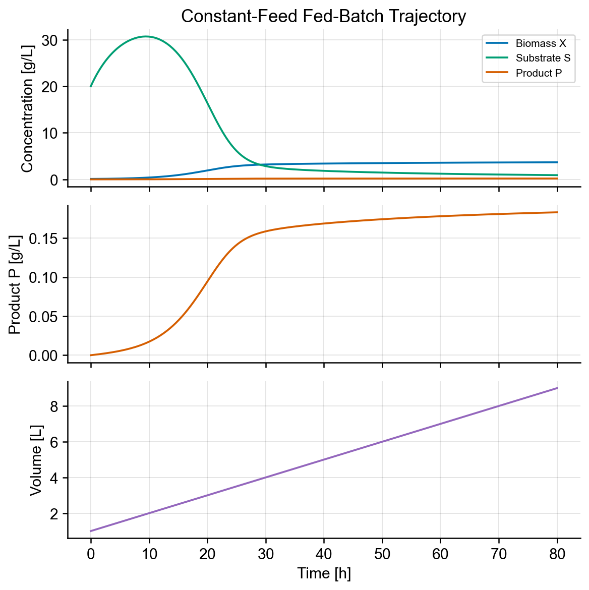
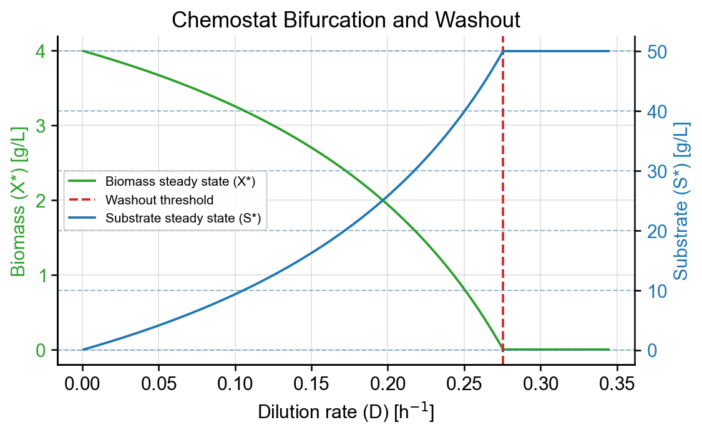
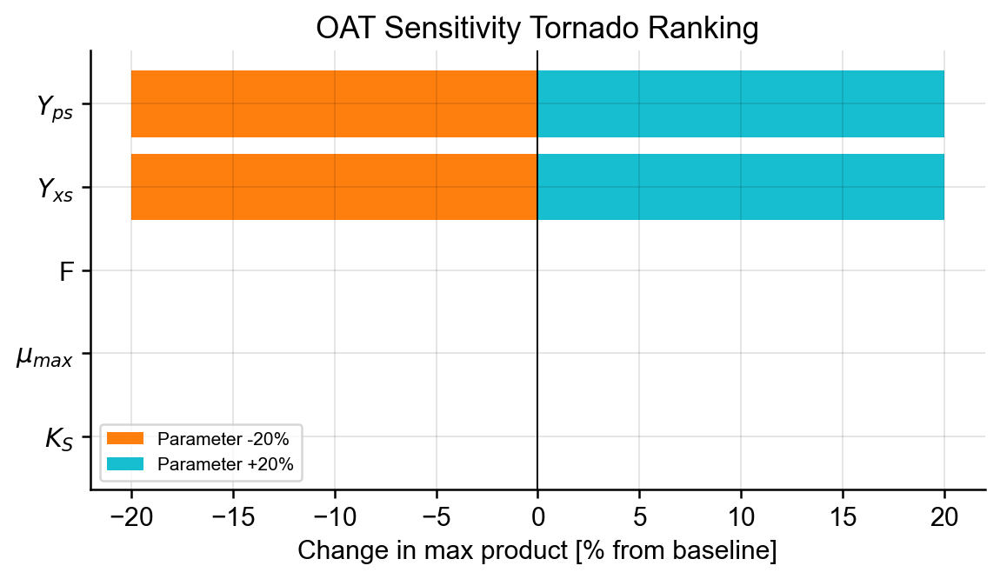

# Bioreactor Digital Twin V1: From Monod Kinetics to Fed-Batch Simulation

## Project Summary

Bioreactor Digital Twin V1 is a compact Python simulator for connecting Monod growth kinetics to batch, fed-batch, and chemostat reactor behavior. The current version is a mechanistic modeling artifact rather than a calibrated process model: it focuses on transparent equations, reproducible trajectories, washout analysis, and sensitivity checks.

- **Repository:** [github.com/seanhu0401/bioreactor-digital-twin](https://github.com/seanhu0401/bioreactor-digital-twin)
- **Notebook:** `notebooks/bioreactor_digital_twin.py`
- **Status:** v1.0 project write-up; parameters are illustrative defaults, not empirical fits
- **Methods:** Monod kinetics, ODE simulation, fed-batch volume dynamics, chemostat washout analysis, one-at-a-time sensitivity analysis

## Purpose

This is a write-up for version 1.0 of my bioreactor digital twin project: a minimal Python simulator for exploring core bioreactor dynamics. I want this page to explain what the model assumes, how the equations are implemented, and what the current outputs show.

The article is tied to v1.0. If the package changes substantially, I will update this page or write a separate version-specific follow-up.

## Overview

The bioreactor digital twin v1.0 package is a compact mechanistic simulator for fed-batch growth, chemostat washout, and one-at-a-time parameter sensitivity analysis. It is not fitted to experimental data. It uses a theoretical system of ordinary differential equations (**ODEs**) to explore expected behavior under controlled assumptions.

The examples below come from the current implementation: a fed-batch trajectory, a chemostat washout/bifurcation plot, and a tornado plot for one-at-a-time (**OAT**) sensitivity analysis.

The source code and Marimo notebook are linked in the project summary above.

## Context

Bioreactor models can become complicated quickly. Real systems involve oxygen transfer, pH, temperature, inhibition, cell death, product toxicity, measurement noise, and control decisions. This project starts smaller on purpose, since a minimal ODE model makes it easier to distinguish the bioreactor behavior from the biological assumptions, operating mode, and numerical setup. 

The v1 simulator uses Monod growth as the main kinetic model for the system and runs that same model under different operating assumptions. In this article, we use the v1 simulator in three different ways: fed-batch simulation, chemostat simulation, and sensitivity analysis under fed-batch conditions. Each one answers a different type of question. Fed-batch simulation asks a trajectory question: how do biomass, substrate, product, and volume evolve under a chosen feed policy? Chemostat simulation asks a steady-state question: when does continuous dilution support a productive reactor, and when does it wash the culture out? The sensitivity example adds a third question: for a chosen metric, which assumptions actually move the result?

## Approach

The v1 model treats the bioreactor as a single well-mixed reactor with four dynamic states. The same right-hand side covers every operating mode; the feed policy and outflow setting determine whether the run behaves like batch, fed-batch, or chemostat operation. The details below are the parts that matter most for interpreting the figures.

### Model State and Kinetics

The dynamic state is the vector $[X, S, P, V]$: biomass $X$, substrate $S$, and product $P$ concentrations (g/L), plus reactor volume $V$ (L). Tracking $V$ explicitly is what lets one set of equations describe both volume-changing (fed-batch) and constant-volume (chemostat) operation.

Growth was modeled via Monod substrate-limited kinetics:

$$
\mu(S) = \frac{\mu_{\text{max}}\, S}{K_S + S}
$$

where $\mu_{\text{max}}$ is the maximum specific growth rate and $K_S$ is the half-saturation constant. Product formation was assumed to be growth-coupled through a single yield, so product is made only while cells grow:

$$
q_p(S) = Y_{ps}\,\mu(S)
$$

The balances, written in concentration form with dilution rate $D = F / V$, are:

$$
\begin{aligned}
\frac{dX}{dt} &= \mu X - k_d X - D X \\[2pt]
\frac{dS}{dt} &= -\frac{\mu X}{Y_{xs}} + D\,(S_f - S) \\[2pt]
\frac{dP}{dt} &= q_p X - D P \\[2pt]
\frac{dV}{dt} &= F \ \text{(no outflow)} \quad \text{or} \quad 0 \ \text{(with outflow)}
\end{aligned}
$$

Here $Y_{xs}$ is the biomass yield from substrate, $S_f$ the feed substrate concentration, and $k_d$ an optional first-order death/maintenance term that is off by default ($k_d = 0$). The dilution terms account for fresh feed entering and, when there is an outflow, material leaving at the same rate.

### Operating Modes

The single right-hand side supports four modes, selected by a feed function $F(t, V)$ and an outflow flag:

- **Batch:** no feed ($F = 0$) and no outflow. Volume is constant and the reactor runs down its initial substrate.
- **Constant-feed fed-batch:** constant $F$, no outflow. Volume rises over time; this is the mode used for the trajectory and sensitivity examples below.
- **Exponential fed-batch:** $F(t) = F\,e^{\alpha t}$, no outflow. The feed ramps up over time.
- **Chemostat:** constant $F$ with outflow on. Volume is held fixed ($dV/dt = 0$) and the dilution term removes biomass, substrate, and product, so the reactor can settle to a continuous steady state or wash out.

To keep fed-batch runs physically sensible, the feed is smoothly reduced toward zero as $V$ approaches the reactor capacity $V_{\text{max}}$, using a $\tanh$ squashing factor rather than a hard cutoff. This avoids a discontinuous right-hand side that would otherwise make the solver work harder near the volume cap. The trade-off is that the analytical fed-batch mass-balance and substrate checks assume the cap is not engaged, so the curated examples are sized to stay below $V_{\text{max}}$.

### Numerical Simulation

The ODE system is integrated with SciPy's `solve_ivp` using the `LSODA` method. `LSODA` switches between non-stiff and stiff integrators, which is useful here because the model can move between regimes as substrate depletes, the feed strategy changes, or parameters are swept. That gives one reasonable default across the examples instead of hand-picking a solver for each run. Before solving, the simulator checks that the initial volume in the state vector matches $V_0$, so a mismatched initial condition fails loudly instead of quietly producing a wrong trajectory.

The curated examples and the validation tests use tight tolerances (`rtol = 1e-9`, `atol = 1e-11`). These are chosen so the runs can be checked against analytical mass balances and steady states, not because every exploratory run needs that precision. For new parameter regimes, especially deliberately stiff ones, the solver choice and tolerances should be revisited.

### Sensitivity Analysis

Sensitivity is computed one parameter at a time (**OAT**). Starting from the default parameters, each selected parameter is perturbed by a fixed fraction up and down ($\pm 20\%$ in the tornado example) while the others are held fixed, and the model is re-simulated in constant-feed fed-batch mode. The reported outcome is the change in a scalar metric, either maximum biomass or maximum product concentration over the run, expressed as a fraction of the baseline value. The tornado ranking sorts the parameters by the larger of their up/down absolute effects, so the parameters that move the outcome most appear at the top. Because OAT is local and varies one parameter at a time, it captures direct effects but not interactions between parameters.

### Validation Checks

The examples are backed by an automated test suite rather than visual inspection alone. The checks cover the feed modes, constant-feed fed-batch mass balance, quasi-steady-state (**QSS**) substrate tracking, chemostat steady-state convergence and washout behavior, sensitivity input validation, and tornado ranking order. These tests pin the analytical relationships the model is supposed to satisfy, so a regression in the kinetics, feed logic, or solver setup surfaces as a failing test instead of a quietly wrong figure.

## Results / Examples

These examples were generated from the ODE simulation code and the Marimo notebook. I focus on three outputs: the fed-batch trajectory, the chemostat washout/bifurcation plot, and the OAT sensitivity tornado plot.

Most parameters use the package defaults. The sensitivity analysis is the exception because it intentionally perturbs selected parameters to compare their effect on one outcome.

### Fed-Batch Trajectory

This plot uses the package's constant-feed fed-batch mode. Because material enters the reactor without a matching outlet, the volume must also be tracked. Otherwise, a simulated process could quietly exceed the working volume, which is one of the practical constraints in semi-batch operation.

The substrate concentration (green) initially increases, then starts to decrease after about 10 hours. Biomass concentration (blue) begins increasing around the same time. Under the current parameter setup, this is expected: once enough substrate is available, biomass growth outpaces the dilution effect from the incoming feed. Between roughly hour 10 and hour 30, substrate drops quickly while biomass increases fastest. This follows from the Monod growth term, where biomass growth depends on both substrate concentration and biomass concentration. Once the substrate is depleted, biomass concentration stays relatively flat. 

The middle panel shows product on its own axis. Product accumulates monotonically over the simulation, with its fastest increase occurring during the same window as the fastest substrate decrease and biomass increase.

The last panel shows the volume trajectory. Since this fed-batch setup has an inlet but no outlet, volume increases over time.

### Chemostat Washout / Bifurcation

A chemostat runs continuously: fresh medium enters the reactor while an equal volume leaves, keeping the reactor volume fixed. That makes the dilution rate, $D$, a control parameter. At low $D$, cells can grow fast enough to replace the biomass leaving through the outlet, so the reactor settles to a nonzero biomass steady state. As $D$ increases, the steady-state biomass falls because cells are being removed faster relative to their growth.

Washout occurs when dilution outpaces the maximum sustainable growth in the reactor. Beyond that threshold, biomass is driven toward zero, and growth-coupled product formation disappears with it. In the figure, the red dotted line marks this washout threshold. To the left of the line, the model predicts a productive steady state; to the right, the only stable operating point is the washed-out state.

This is also why the plot is a bifurcation diagram. Changing $D$ does not shift the steady state smoothly forever. It changes the qualitative behavior of the system where the reactor moves from a biomass-containing steady state to a zero-biomass washout state.

### OAT Sensitivity Tornado

For the one-at-a-time (**OAT**) sensitivity analysis, the model was run in constant-feed fed-batch mode and the outcome metric was the maximum product concentration over the 80-hour simulation. The baseline run reached a maximum product concentration of about $0.177$ g/L. Each parameter was then varied up and down by $20\%$ while the others were held fixed.

The tornado plot shows that $Y_{ps}$ and $Y_{xs}$ dominate this metric. Changing either yield by $\pm 20\%$ changes the maximum product concentration by the same $\pm 20\%$. That result is a useful sanity check: product formation is growth-coupled through $Y_{ps}$, and $Y_{xs}$ controls how much biomass can be made from the available substrate.

The other tested parameters, $F$, $\mu_{\text{max}}$, and $K_S$, each changed the maximum product concentration by less than $0.1\%$ in this setup. The interpretation is that this particular run is yield-limited, not kinetics-limited. The fixed feed schedule and 80-hour horizon fix the total amount of substrate added, and the system consumes that substrate almost completely. The kinetic parameters mostly change when product is formed, not how much product can ultimately accumulate.

This is still a local OAT result. It is useful for checking direct effects around the default parameter set, but it does not capture parameter interactions. If the goal is to rank uncertainty across a wider parameter space, a global method such as Sobol sensitivity analysis should be used instead.

## Limitations

This v1 model is intentionally minimal. It is useful for testing the core simulation workflow, but it is not a calibrated bioreactor model. The main limitations are:

1. Parameters are illustrative defaults, not fitted to empirical bioreactor data.
2. No empirical calibration or parameter-estimation workflow is included yet.
3. Oxygen transfer, pH, temperature, inhibition, substrate toxicity, and product toxicity are not modeled.
4. Feed profiles are prescribed modes, not optimized control policies.
5. Product formation is simplified as growth-coupled.
6. Solver choice and tolerances should be revisited for new parameter regimes, especially deliberately stiff cases.

These limitations are intentional for v1.0, but they help define the next directions for the project: calibration, richer biology, and eventually some form of control or optimization.

## Next Steps

For the next version, I want to expand the model without losing the simple baseline. The most natural directions are:

1. Add an interactive companion notebook for parameter and feed-mode exploration.
2. Add biological mechanisms such as maintenance, death, inhibition, oxygen limitation, or product toxicity.
3. Explore feed optimization and control-oriented simulation.
4. Add parameter estimation using synthetic data or experimental data, if available.

This is a general direction for the project and not a comprehensive list or release promises. Some items may move into later versions as the model gets tested against more demanding examples.

## Repository

The implementation, tests, notebook, and generated figures are available in the public repository: [github.com/seanhu0401/bioreactor-digital-twin](https://github.com/seanhu0401/bioreactor-digital-twin).

